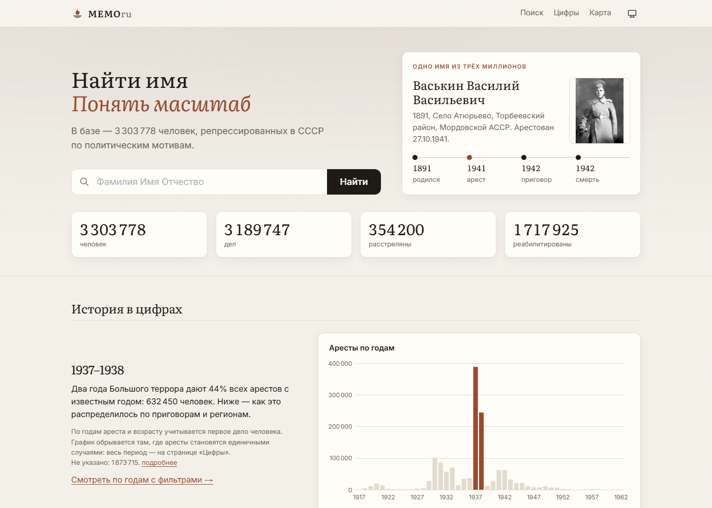
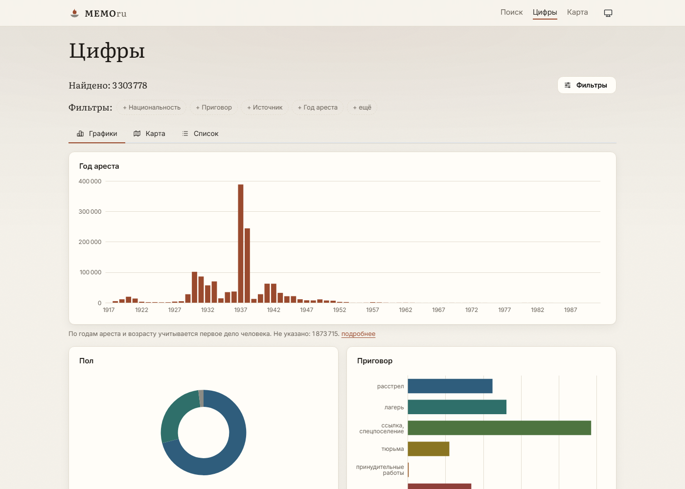
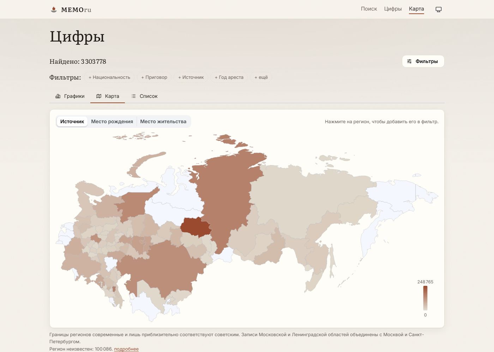
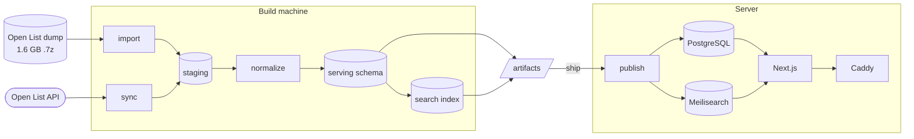

<div align="center">


# MEMOru

**Names and numbers of political repression in the USSR**

A public, searchable site over 3.3 million records of the [Open List](https://ru.openlist.wiki) database:
a page for every person, charts and a map across eleven dimensions, and a name search.

[](https://github.com/yanfishel/memoru/actions/workflows/ci.yml)
[](https://github.com/yanfishel/memoru/releases)
[](LICENSE)
[](https://creativecommons.org/licenses/by-sa/4.0/)
<br />
[](https://nextjs.org)
[](https://www.postgresql.org)
[](https://www.meilisearch.com)

**[memoru.net](https://memoru.net)**

**English** · [Русский](README.ru.md)

</div>

<picture>
  <source media="(prefers-color-scheme: dark)" srcset="docs/screenshots/home-dark.png" />
  
</picture>

<table>
  <tr>
    <td width="50%">
      <picture>
        <source media="(prefers-color-scheme: dark)" srcset="docs/screenshots/explore-dark.png" />
        
      </picture>
    </td>
    <td width="50%">
      <picture>
        <source media="(prefers-color-scheme: dark)" srcset="docs/screenshots/map-dark.png" />
        
      </picture>
    </td>
  </tr>
  <tr>
    <td align="center"><sub>Charts across eleven dimensions, with click-to-filter</sub></td>
    <td align="center"><sub>Where the records come from, by region and country</sub></td>
  </tr>
</table>

## Features

- **A page for every person.** Each page has a narrative built from the source record, a timeline of the case, the original fields in the source's own words, similar records, and a link back to the Open List page.
- **Explore.** Charts, a map and a sortable list over sex, nationality, birth, arrest and death years, age, sentence, region, education and party membership. The filters live in the URL, so every view can be shared.
- **Name search.** Meilisearch with typo tolerance, combined with any filter.
- **Honest numbers.** Missing and unrecognised values are counted and shown, never dropped.
- **Light and dark themes**, a print layout, social cards, and a sitemap for all 3.3M pages.
- **Monthly refresh.** An incremental sync pulls edits from the Open List API. Data builds are versioned, published atomically and can be rolled back in under a second.

The site's interface is in Russian, the language of the source.

## How it works



- **The ETL** (`scripts/etl/`, TypeScript) streams the MediaWiki dump through 7-Zip into PostgreSQL with `COPY`. It parses the record templates and normalises them against dictionaries in `data/dicts/`.
- **The serving layer** is a versioned `serving_<build>` schema plus a matching `people_<build>` search index. `public.serving_slot` points at the active pair, and publishing a build is a single swap.
- **The site** (`src/`) is Next.js 16 with Mantine 9 and ECharts. It reads the active build through Drizzle and never names a schema.
- **The server** receives a finished database; it runs none of the data pipeline.

## Requirements

- Node.js 22 and pnpm 11 (`corepack enable`)
- Docker with Compose, for PostgreSQL 18 and Meilisearch
- 7-Zip, only for a from-scratch import from the dump
- 30 GB or more of free disk for a full dataset: the database, the search index, the dump, and temporary space during import

## Getting started

```bash
git clone https://github.com/yanfishel/memoru.git
cd memoru
cp .env.example .env        # then adjust the paths and API_USER_AGENT
docker compose up -d        # PostgreSQL + Meilisearch (dev and test)
pnpm install
pnpm etl db-ping            # checks the database connection
```

### Load the data

Download the dump `ruopenlistwiki-20230301_mainspace_and_files-history.xml.7z` from the
[Internet Archive](https://archive.org/details/wiki-ruopenlistwiki). Set `DUMP_PATH` and
`SEVEN_ZIP_PATH` in `.env`, then:

```bash
pnpm etl import                           # dump → staging (~17 min for 3.3M records)
pnpm etl sync --exclude-user "OL Robot"   # catch up from the API: hours on the first run
pnpm etl normalize
pnpm etl check                            # coverage report; fails on errors
pnpm etl labels
pnpm etl aggregate                        # builds serving_<build> and activates it
pnpm etl index                            # builds the people_<build> search index
pnpm dev                                  # http://localhost:3000
```

`sync` calls the live wiki. Before running it, put a real contact in `API_USER_AGENT`, and keep
`API_MIN_INTERVAL_MS` generous: the wiki throttles. Excluding the `OL Robot` bot keeps the catch-up to
hours instead of days. Every command has `--help`.

## Development

| Command | What it does |
|---|---|
| `pnpm dev` | Site in development mode, against the active build |
| `pnpm build` / `pnpm start` | Production build and server |
| `pnpm typecheck` / `pnpm lint` | Types and ESLint |
| `pnpm test` | Unit tests (Vitest). Export `SEVEN_ZIP_PATH` to include the 7-Zip tests |
| `pnpm test:integration` | Against the dev containers; needs `TEST_DATABASE_URL` and `TEST_MEILI_URL` |
| `pnpm test:e2e` | Playwright smoke set after `pnpm build`; set `E2E_BASE_URL` to test a deployed site |
| `pnpm etl <command>` | The ETL CLI: `import`, `sync`, `normalize`, `check`, `aggregate`, `index`, `build-artifacts`, `ship`, `publish`, `rollback`, … |
| `pnpm geo:build` | Rebuilds the map geometry from Natural Earth |

```
scripts/etl/   dump, parse, normalize, api sync, serving build, search index, artifacts
src/app/       routes: home, /explore, /search, /person/[id], /about, sitemap, API
src/lib/       view models, filters and formatting (pure, browser-safe)
data/          dictionaries, labels, sample pages for tests
docs/          screenshots for this README
```

Code, comments and commits are in English. Every UI string lives in `src/lib/ui-text.ts`.

## Deployment

The server runs `docker-compose.prod.yml`: Caddy with automatic HTTPS, the site, PostgreSQL and
Meilisearch. The ETL is a `tools` profile of the same image. Code and data ship separately:

- **Code.** Publishing a GitHub release `vX.Y.Z` runs the checks, pushes
  `ghcr.io/yanfishel/memoru:vX.Y.Z` and deploys it over SSH. The deploy script waits for
  `/api/health` and falls back to the previous image if the new one fails. To roll back, run
  `gh workflow run release -f tag=<older tag>`.
- **Data.** Build on your own machine and publish on the server:

  ```bash
  pnpm etl build-artifacts            # pg_dump + search documents + manifest
  pnpm etl ship --build-id <build>    # rsync, verified by checksum
  # on the server
  docker compose -f docker-compose.prod.yml run --rm etl publish --build-id <build>
  docker compose -f docker-compose.prod.yml run --rm etl rollback   # if needed
  ```

  `publish` restores into a new schema, indexes it and swaps. The site keeps serving the old
  build until the swap.

`.env.prod.example` lists the server's settings. `docker-compose.server.yml` is a local stand-in
for the server, used to rehearse a publish.

## License and attribution

The code is released under the [MIT License](LICENSE).

The data comes from the [Open List](https://ru.openlist.wiki) database ("Открытый список") and is
available under [CC BY-SA 4.0](https://creativecommons.org/licenses/by-sa/4.0/). Anything built from it
must credit the Open List and carry the same license. Corrections to a person's record belong on
their Open List page; the next monthly refresh brings them here.
