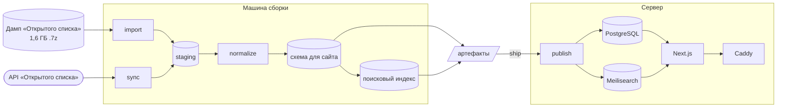

<div align="center">


# MEMOru

**Имена и цифры репрессий в СССР**

Открытый сайт с поиском по 3,3 миллиона записей базы [«Открытый список»](https://ru.openlist.wiki):
страница для каждого человека, графики и карта по одиннадцати измерениям, поиск по имени.

[](https://github.com/yanfishel/memoru/actions/workflows/ci.yml)
[](https://github.com/yanfishel/memoru/releases)
[](LICENSE)
[](https://creativecommons.org/licenses/by-sa/4.0/deed.ru)
<br />
[](https://nextjs.org)
[](https://www.postgresql.org)
[](https://www.meilisearch.com)

**[memoru.net](https://memoru.net)**

[English](README.md) · **Русский**

</div>

<picture>
  <source media="(prefers-color-scheme: dark)" srcset="docs/screenshots/home-dark.png" />
  
</picture>

<table>
  <tr>
    <td width="50%">
      <picture>
        <source media="(prefers-color-scheme: dark)" srcset="docs/screenshots/explore-dark.png" />
        
      </picture>
    </td>
    <td width="50%">
      <picture>
        <source media="(prefers-color-scheme: dark)" srcset="docs/screenshots/map-dark.png" />
        
      </picture>
    </td>
  </tr>
  <tr>
    <td align="center"><sub>Графики по одиннадцати измерениям, фильтр по клику</sub></td>
    <td align="center"><sub>Откуда записи: по регионам и странам</sub></td>
  </tr>
</table>

## Возможности

- **Страница для каждого человека.** На ней рассказ, собранный из записи источника, хронология дела, исходные поля в формулировках источника, похожие записи и ссылка на страницу в «Открытом списке».
- **Цифры.** Графики, карта и сортируемый список по полу, национальности, годам рождения, ареста и смерти, возрасту, приговору, региону, образованию и партийности. Фильтры хранятся в адресе страницы, поэтому любым видом можно поделиться.
- **Поиск по имени.** Meilisearch с учётом опечаток, в сочетании с любыми фильтрами.
- **Честные цифры.** Неизвестные и нераспознанные значения учитываются и показываются, а не отбрасываются.
- **Светлая и тёмная темы**, версия для печати, карточки для соцсетей и карта сайта на все 3,3 млн страниц.
- **Ежемесячное обновление.** Инкрементальная синхронизация забирает правки через API «Открытого списка». Сборки данных версионируются, публикуются атомарно и откатываются меньше чем за секунду.

## Как это устроено



- **ETL** (`scripts/etl/`, TypeScript) прогоняет дамп MediaWiki через 7-Zip прямо в PostgreSQL командой `COPY`. Он разбирает шаблоны записей и нормализует значения по справочникам из `data/dicts/`.
- **Слой для сайта** — версионированная схема `serving_<build>` и парный поисковый индекс `people_<build>`. `public.serving_slot` указывает на активную пару, так что публикация сборки — одно переключение.
- **Сайт** (`src/`) написан на Next.js 16 с Mantine 9 и ECharts. Он читает активную сборку через Drizzle и никогда не обращается к схеме по имени.
- **Сервер** получает готовую базу и не выполняет никаких этапов обработки данных.

## Требования

- Node.js 22 и pnpm 11 (`corepack enable`)
- Docker с Compose — для PostgreSQL 18 и Meilisearch
- 7-Zip — только для импорта с нуля из дампа
- От 30 ГБ свободного места для полного набора данных: база, поисковый индекс, дамп и временное место во время импорта

## Установка

```bash
git clone https://github.com/yanfishel/memoru.git
cd memoru
cp .env.example .env        # затем поправьте пути и API_USER_AGENT
docker compose up -d        # PostgreSQL + Meilisearch (рабочие и тестовые)
pnpm install
pnpm etl db-ping            # проверяет подключение к базе
```

### Загрузка данных

Скачайте дамп `ruopenlistwiki-20230301_mainspace_and_files-history.xml.7z` из
[Internet Archive](https://archive.org/details/wiki-ruopenlistwiki). Укажите `DUMP_PATH` и
`SEVEN_ZIP_PATH` в `.env`, затем:

```bash
pnpm etl import                           # дамп → staging (~17 минут на 3,3 млн записей)
pnpm etl sync --exclude-user "OL Robot"   # догнать изменения через API: при первом запуске несколько часов
pnpm etl normalize
pnpm etl check                            # отчёт о покрытии; при ошибках завершается с ошибкой
pnpm etl labels
pnpm etl aggregate                        # собирает serving_<build> и делает её активной
pnpm etl index                            # собирает поисковый индекс people_<build>
pnpm dev                                  # http://localhost:3000
```

`sync` обращается к живой вики. Перед запуском укажите в `API_USER_AGENT` настоящий контакт и не
уменьшайте `API_MIN_INTERVAL_MS`: вики ограничивает частоту запросов. Без правок бота `OL Robot`
синхронизация занимает часы, а не дни. У каждой команды есть `--help`.

## Разработка

| Команда | Что делает |
|---|---|
| `pnpm dev` | Сайт в режиме разработки, на активной сборке |
| `pnpm build` / `pnpm start` | Продакшен-сборка и сервер |
| `pnpm typecheck` / `pnpm lint` | Проверка типов и ESLint |
| `pnpm test` | Юнит-тесты (Vitest). Чтобы включить тесты 7-Zip, экспортируйте `SEVEN_ZIP_PATH` |
| `pnpm test:integration` | На локальных контейнерах; нужны `TEST_DATABASE_URL` и `TEST_MEILI_URL` |
| `pnpm test:e2e` | Набор Playwright после `pnpm build`; `E2E_BASE_URL` проверяет развёрнутый сайт |
| `pnpm etl <command>` | CLI для ETL: `import`, `sync`, `normalize`, `check`, `aggregate`, `index`, `build-artifacts`, `ship`, `publish`, `rollback`, … |
| `pnpm geo:build` | Пересобирает геометрию карты из Natural Earth |

```
scripts/etl/   дамп, разбор, нормализация, синхронизация по API, сборка для сайта, поисковый индекс, артефакты
src/app/       маршруты: главная, /explore, /search, /person/[id], /about, карта сайта, API
src/lib/       модели представления, фильтры и форматирование (чистые, работают в браузере)
data/          справочники, подписи, образцы страниц для тестов
docs/          скриншоты для этого README
```

Код, комментарии и коммиты пишутся на английском. Все строки интерфейса лежат в `src/lib/ui-text.ts`.

## Развёртывание

На сервере работает `docker-compose.prod.yml`: Caddy с автоматическим HTTPS, сайт, PostgreSQL и
Meilisearch. ETL запускается из того же образа как профиль `tools`. Код и данные выкатываются отдельно:

- **Код.** Публикация релиза `vX.Y.Z` на GitHub запускает проверки, пушит
  `ghcr.io/yanfishel/memoru:vX.Y.Z` и выкатывает его по SSH. Скрипт выкатки ждёт ответа
  `/api/health` и возвращает предыдущий образ, если новый не поднялся. Откат:
  `gh workflow run release -f tag=<старый тег>`.
- **Данные.** Сборка на своей машине, публикация на сервере:

  ```bash
  pnpm etl build-artifacts            # pg_dump + документы для поиска + манифест
  pnpm etl ship --build-id <build>    # rsync с проверкой контрольных сумм
  # на сервере
  docker compose -f docker-compose.prod.yml run --rm etl publish --build-id <build>
  docker compose -f docker-compose.prod.yml run --rm etl rollback   # если нужно
  ```

  `publish` восстанавливает сборку в новую схему, индексирует её и переключает. До переключения
  сайт продолжает работать на старой сборке.

Настройки сервера перечислены в `.env.prod.example`. `docker-compose.server.yml` заменяет сервер
локально — на нём репетируют публикацию.

## Лицензия и атрибуция

Код распространяется по [лицензии MIT](LICENSE).

Данные взяты из базы [«Открытый список»](https://ru.openlist.wiki) и доступны по лицензии
[CC BY-SA 4.0](https://creativecommons.org/licenses/by-sa/4.0/deed.ru). Всё, что построено на их
основе, должно указывать «Открытый список» как источник и распространяться на тех же условиях.
Исправления в записи о человеке вносятся на его странице в «Открытом списке», и при следующем
ежемесячном обновлении они появятся здесь.
